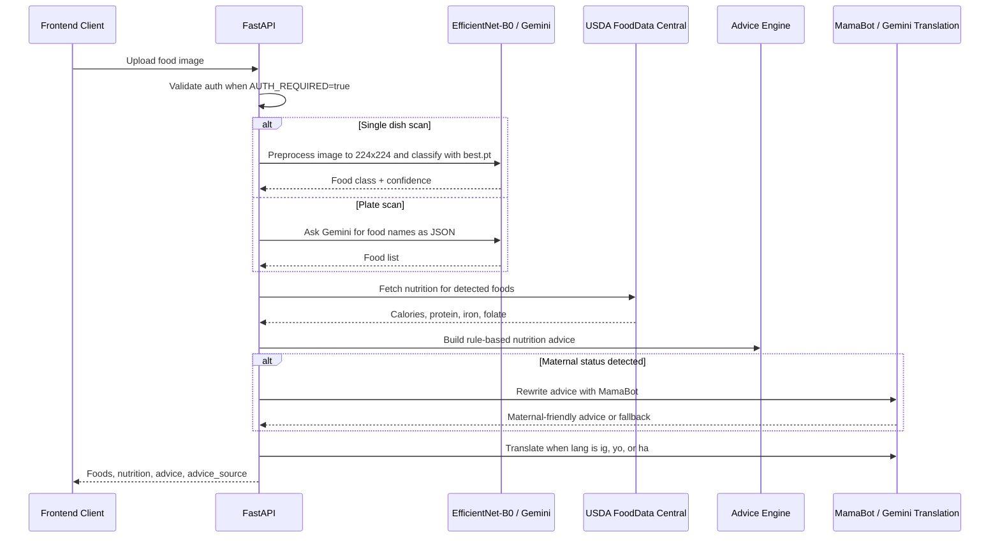
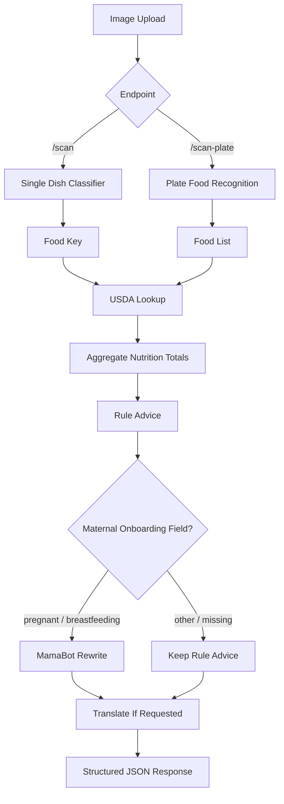

# Foodscan Backend

Foodscan Backend is a FastAPI-powered AI nutrition service for the NutriPadi
mobile app. It accepts food images, identifies African meals, enriches them with
nutrition data, and returns simple maternal nutrition advice in the user's
preferred language.

The application is designed as a practical AI/ML backend: local computer vision
inference runs inside the API, external AI services are used only where they add
value, and every optional dependency has a graceful fallback so the scan flow can
keep working.

## What The Application Does

- Detects single-dish African meals with a local EfficientNet-B0 image classifier.
- Recognizes multi-food plates with Gemini vision prompting.
- Maps detected foods to USDA FoodData Central nutrition records.
- Calculates meal-level calories, protein, iron, and folate.
- Generates clear nutrition guidance from rule-grounded thresholds with varied coach wording.
- Routes pregnant or breastfeeding users through MamaBot for warmer maternal advice.
- Translates advice to English, Igbo, Yoruba, or Hausa with English fallback.
- Optionally verifies frontend users with Supabase Auth before processing scans.

## Architecture

```mermaid
flowchart LR
    Mobile[Mobile App / Frontend] -->|multipart image + lang + optional user status| API[FastAPI Backend]
    API --> Auth{AUTH_REQUIRED?}
    Auth -->|true| Supabase[Supabase Auth]
    Auth -->|false| ScanRouter[Scan Router]
    Supabase --> ScanRouter

    ScanRouter -->|POST /scan| LocalCV[EfficientNet-B0 Classifier]
    ScanRouter -->|POST /scan-plate| GeminiVision[Gemini Plate Recognition]

    LocalCV --> Nutrition[USDA Nutrition Lookup]
    GeminiVision --> Nutrition
    Nutrition --> AdviceRules[Rule-Based Nutrition Advice]
    AdviceRules --> MaternalGate{Pregnant or Breastfeeding?}

    MaternalGate -->|yes + HF_TOKEN| MamaBot[MamaBot on Hugging Face]
    MaternalGate -->|no or fallback| Advice[Final Advice]
    MamaBot --> Advice
    Advice --> Translation[Gemini Translation]
    Translation --> Response[JSON Response]
    Response --> Mobile
```



## ML Inference Pipeline



## Component Breakdown

| Layer | Responsibility | Implementation |
| --- | --- | --- |
| API layer | Receives image uploads and returns structured nutrition results. | FastAPI, multipart form uploads, CORS middleware |
| Auth layer | Optionally protects scan endpoints with frontend user sessions. | Supabase Auth user verification when `AUTH_REQUIRED=true` |
| Vision layer | Classifies single foods locally and identifies multiple foods on a plate. | `best.pt`, `class_names.json`, `timm`, PyTorch, Gemini |
| Nutrition layer | Converts detected food names into nutrient values. | USDA FoodData Central search API |
| Advice layer | Produces reliable nutrition advice without sounding repetitive. | Rule-grounded iron, protein, and folate thresholds with varied wording |
| Maternal AI layer | Personalizes advice for pregnant and breastfeeding users. | MamaBot through Hugging Face Inference API |
| Translation layer | Localizes advice for supported Nigerian languages. | Gemini 2.5 Flash with English fallback |
| Deployment layer | Runs as a containerized Hugging Face Space. | Docker, Uvicorn, CPU PyTorch runtime |

## Endpoint Flow



## API Surface

### `GET /`

Health and runtime configuration check.

```json
{
  "status": "NutriPadi API running",
  "auth_required": false,
  "supabase_configured": true
}
```

### `POST /scan`

Classifies a single food image. The local model handles known trained African
foods, and Gemini acts as a global-food safety net when `GEMINI_KEY` is
available. The endpoint can return African, Western, Asian, Middle Eastern,
mixed, generic, or unknown foods without forcing foreign meals into African
labels.

Form fields:

- `file`: required image upload.
- `lang`: optional response language. Supported values are `en`, `ig`, `yo`, and `ha`.
- `country`: optional selected country for simple local wording, such as `Nigeria`, `Ghana`, `Kenya`, `Ethiopia`, or `Cameroon`.
- `location`: optional selected city or location, such as `Lagos`, `Accra`, `Nairobi`, `Addis Ababa`, or `Douala`.
- `user_status`, `onboarding_status`, `life_stage`, `maternal_status`: optional onboarding context.

Example response:

```json
{
  "foods": [
    {
      "key": "jollof_rice",
      "name": "Nigerian Jollof Rice",
      "food_origin": "african",
      "region": "Nigeria",
      "country": "Nigeria",
      "mapped": true,
      "confidence": 92,
      "source": "model",
      "nutrition": {
        "match": "rice tomato stew",
        "calories": 142,
        "protein_g": 3.1,
        "iron_mg": 1.2,
        "folate_mcg": 20
      }
    }
  ],
  "summary": "This meal gives energy, but it is low in blood-building iron...",
  "summary_en": "This meal gives about 142 calories for energy...",
  "advice": "This meal does not have much iron. Add beans, ugu, egg, fish, or meat when you can.",
  "advice_en": "This meal does not have much iron...",
  "advice_source": "rules",
  "response_style": {
    "country_or_region": "Nigeria",
    "language": "English",
    "plain_terms": true,
    "local_style": "nigeria",
    "source": "gemini",
    "varied": true
  }
}
```

### `POST /scan-plate`

Recognizes multiple foods on a plate with Gemini, then aggregates nutrition
across the full meal. Gemini can return catalog African foods and open-ended
global foods.

Example response:

```json
{
  "foods": [
    {
      "key": "jollof_rice",
      "name": "Nigerian Jollof Rice",
      "food_origin": "african",
      "region": "Nigeria",
      "country": "Nigeria",
      "mapped": true,
      "source": "gemini",
      "nutrition": {
        "match": "rice tomato stew",
        "calories": 142,
        "protein_g": 3.1,
        "iron_mg": 1.2,
        "folate_mcg": 20
      }
    },
    {
      "key": "fried_plantains_(dodo)",
      "name": "Fried Plantains (Dodo)",
      "food_origin": "african",
      "region": "West Africa",
      "country": "West Africa",
      "mapped": true,
      "source": "gemini",
      "nutrition": {
        "match": "fried plantains",
        "calories": 260,
        "protein_g": 1.3,
        "iron_mg": 0.6,
        "folate_mcg": 14
      }
    }
  ],
  "total": {
    "calories": 402,
    "protein_g": 4.4,
    "iron_mg": 1.8,
    "folate_mcg": 34
  },
  "summary": "This meal gives energy, but it needs more body-building food...",
  "summary_en": "This meal gives about 402 calories for energy...",
  "advice": "This meal does not have much protein...",
  "advice_en": "This meal does not have much protein...",
  "advice_source": "mamabot",
  "response_style": {
    "country_or_region": "Nigeria",
    "language": "English",
    "plain_terms": true,
    "local_style": "nigeria",
    "source": "gemini",
    "varied": true
  }
}
```

If the scanned food is outside the catalog, the API still returns it instead of
forcing it into an African food label:

```json
{
  "foods": [
    {
      "key": "pizza",
      "name": "Pizza",
      "food_origin": "western",
      "mapped": false,
      "source": "gemini_open",
      "nutrition": {
        "match": "PIZZA",
        "calories": 266,
        "protein_g": 11,
        "iron_mg": 2.5,
        "folate_mcg": 90
      },
      "model_guess": {
        "key": "jollof_rice",
        "name": "Nigerian Jollof Rice",
        "confidence": 54
      }
    }
  ]
}
```

For western or other out-of-catalog foods, configure `GEMINI_KEY`. Without
Gemini, `/scan` can only use the local model's trained labels; low-confidence
model-only results are returned with `needs_review: true`.

Detection follows this rule:

- Detect any food from anywhere.
- If it is African, use the correct African country or local name where possible.
- If it is Western, Asian, Middle Eastern, mixed, or foreign, say exactly what it is.
- Do not force foreign or unclear foods into African names.
- Mark unclear foods with `food_origin: "unknown"` and `needs_review: true`.

Example local advice for a Nigerian user scanning pizza:

```text
This looks like Pizza. It can be filling, but try adding a side of vegetables or fruit later today.
```

### `GET /foods`

Returns backend-provided food options for correction/search UI. The frontend
should use this instead of hardcoding all detected food types.

```text
GET /foods?q=pizza
```

```json
{
  "foods": [
    {
      "key": "pizza",
      "name": "Pizza",
      "region": null,
      "country": null,
      "food_origin": "western",
      "aliases": [],
      "mapped": false,
      "source": "open_food"
    }
  ],
  "open_foods_supported": true,
  "correction_source": "backend"
}
```

## Plain Local Responses

The frontend can send `country` or `location` with each scan request so the
backend rewrites `summary` and `advice` in simple words for that selected place.
Supported local styles include Nigeria, Ghana, Kenya, Ethiopia, Cameroon, and
West Africa. City names such as Lagos, Accra, Nairobi, Addis Ababa, Douala, and
Yaounde are mapped to their countries.

When `GEMINI_KEY` is available, the backend rewrites the message in the selected
language and local speaking style with sampling enabled so the coach does not
sound like a repeated script. When Gemini is unavailable, the API keeps a plain
rule-based response but rotates safe wording and local food tips.

## Maternal Advice Routing

The frontend can send any of these optional form fields with `/scan` or
`/scan-plate`:

- `user_status`
- `onboarding_status`
- `life_stage`
- `maternal_status`

When the normalized value is one of the maternal statuses below, the backend
tries MamaBot and labels the response with `advice_source: "mamabot"`.

- `pregnant`
- `pregnancy`
- `expecting`
- `breastfeeding`
- `breast_feeding`
- `lactating`
- `nursing`

If `HF_TOKEN` is missing or the MamaBot request fails, the backend returns the
rule-based advice and labels the response with `advice_source: "rules"`.

## Model And Data Assets

| Asset | Purpose |
| --- | --- |
| `best.pt` | Trained PyTorch checkpoint for food classification. |
| `class_names.json` | Label list used to map classifier output indices to food keys. |
| `data/food_catalog.json` | Canonical African food catalog with display names, regional variants, aliases, and nutrition lookup terms. |
| `MAMA_URL` | Hugging Face Inference API endpoint for MamaBot maternal advice rewriting. |
| `GEMINI_URL` | Gemini endpoint used for plate recognition and translation. |

## Food Variant Matching

Food names from the local classifier, Gemini, and the frontend are normalized
through `data/food_catalog.json` before nutrition lookup. The catalog is the
source of truth for regional variants such as `eth_doro_wat`, `ken_ugali`,
`jollof_ghana`, and `jollof_rice`.

The catalog is not the full list of foods the system can detect. It is a mapping
layer for known foods. Gemini can return open-ended foods, including western
foods, and the backend will search USDA with the natural detected name when a
food is not mapped.

To add or correct an African food variant:

1. Add the canonical key to `data/food_catalog.json`.
2. Include common spellings, local names, and unprefixed aliases in `aliases`.
3. Set `display_name`, `region`, and `usda_query`.
4. Only edit `class_names.json` when the model checkpoint has been retrained with
   the same label order.

The API validates on startup that every classifier label exists in the catalog.
Unknown Gemini foods are returned with `mapped: false` and are still eligible for
USDA nutrition lookup using their detected name.

## Configuration

Add these environment variables locally or in Hugging Face Space settings under
**Variables and secrets**.

| Variable | Required | Purpose |
| --- | --- | --- |
| `USDA_API_KEY` | Recommended | Enables nutrition lookup from USDA FoodData Central. |
| `HF_TOKEN` | Optional | Enables MamaBot advice rewriting for maternal users. |
| `GEMINI_KEY` | Optional | Enables `/scan-plate` recognition and non-English translation. |
| `MIN_CLASSIFIER_CONFIDENCE` | Optional | Confidence threshold before `/scan` trusts Gemini over the local model. Defaults to `0.65`. |
| `SUPABASE_URL` | Optional | Supabase project URL for auth verification. |
| `SUPABASE_ANON_KEY` | Optional | Supabase public key used to verify bearer tokens. |
| `AUTH_REQUIRED` | Optional | Set to `true` to require authenticated scan requests. |

## Running Locally

```bash
python -m venv .venv
source .venv/bin/activate
pip install torch torchvision --index-url https://download.pytorch.org/whl/cpu
pip install -r requirements.txt
uvicorn main:app --reload --host 0.0.0.0 --port 7860
```

Then open:

```text
http://localhost:7860/
```

## Docker Deployment

The included `Dockerfile` builds a CPU inference container suitable for Hugging
Face Spaces.

```bash
docker build -t foodscan-backend .
docker run --env-file .env -p 7860:7860 foodscan-backend
```

## AI/ML Engineering Highlights

- Uses a local model for low-latency single-dish inference instead of sending every image to an external API.
- Separates food recognition, nutrition lookup, advice generation, and translation into clear stages.
- Keeps nutrition safety grounded in stable thresholds while varying coach wording through safe templates and LLM sampling.
- Exposes `advice_source` so the frontend can verify whether the response came from MamaBot or rules.
- Keeps external services optional with fallbacks for missing keys, timeouts, or failed model calls.
- Supports deployment as a lightweight CPU container for practical production hosting.
