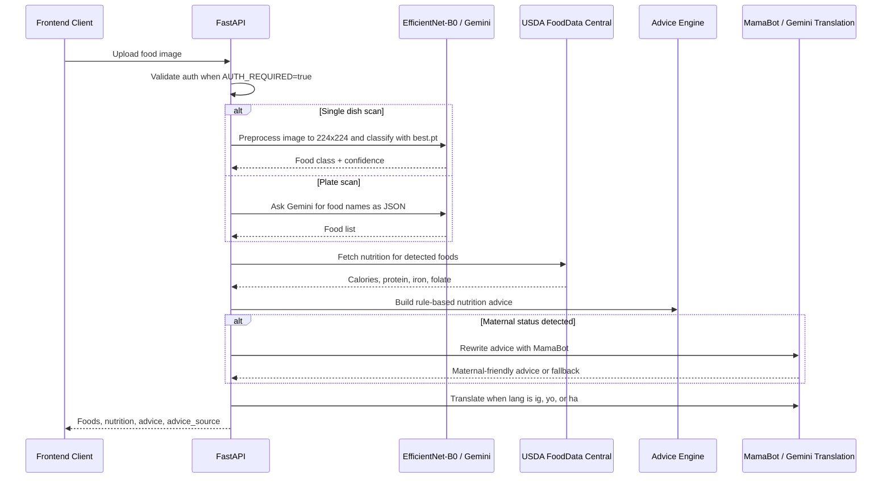
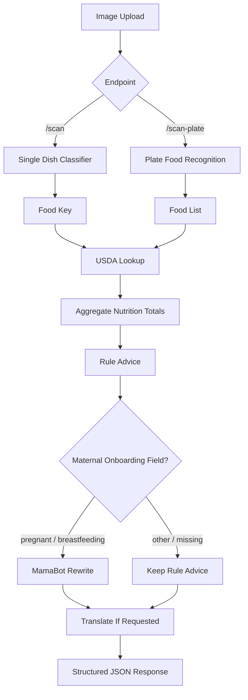

# Foodscan Backend

Foodscan Backend is a FastAPI-powered AI nutrition service for the NutriPadi
mobile app. It accepts food images, identifies African meals, enriches them with
nutrition data, and returns simple maternal nutrition advice in the user's
preferred language.

The application is designed as a practical AI/ML backend: local computer vision
inference runs inside the API, external AI services are used only where they add
value, and every optional dependency has a graceful fallback so the scan flow can
keep working.

## What The Application Does

- Detects single-dish African meals with a local EfficientNet-B0 image classifier.
- Recognizes multi-food plates with Gemini vision prompting.
- Maps detected foods to USDA FoodData Central nutrition records.
- Calculates meal-level calories, protein, iron, and folate.
- Generates clear nutrition guidance from deterministic rules.
- Routes pregnant or breastfeeding users through MamaBot for warmer maternal advice.
- Translates advice to English, Igbo, Yoruba, or Hausa with English fallback.
- Optionally verifies frontend users with Supabase Auth before processing scans.

## Architecture

```mermaid
flowchart LR
    Mobile[Mobile App / Frontend] -->|multipart image + lang + optional user status| API[FastAPI Backend]
    API --> Auth{AUTH_REQUIRED?}
    Auth -->|true| Supabase[Supabase Auth]
    Auth -->|false| ScanRouter[Scan Router]
    Supabase --> ScanRouter

    ScanRouter -->|POST /scan| LocalCV[EfficientNet-B0 Classifier]
    ScanRouter -->|POST /scan-plate| GeminiVision[Gemini Plate Recognition]

    LocalCV --> Nutrition[USDA Nutrition Lookup]
    GeminiVision --> Nutrition
    Nutrition --> AdviceRules[Rule-Based Nutrition Advice]
    AdviceRules --> MaternalGate{Pregnant or Breastfeeding?}

    MaternalGate -->|yes + HF_TOKEN| MamaBot[MamaBot on Hugging Face]
    MaternalGate -->|no or fallback| Advice[Final Advice]
    MamaBot --> Advice
    Advice --> Translation[Gemini Translation]
    Translation --> Response[JSON Response]
    Response --> Mobile
```



## ML Inference Pipeline



## Component Breakdown

| Layer | Responsibility | Implementation |
| --- | --- | --- |
| API layer | Receives image uploads and returns structured nutrition results. | FastAPI, multipart form uploads, CORS middleware |
| Auth layer | Optionally protects scan endpoints with frontend user sessions. | Supabase Auth user verification when `AUTH_REQUIRED=true` |
| Vision layer | Classifies single foods locally and identifies multiple foods on a plate. | `best.pt`, `class_names.json`, `timm`, PyTorch, Gemini |
| Nutrition layer | Converts detected food names into nutrient values. | USDA FoodData Central search API |
| Advice layer | Produces reliable baseline nutrition advice. | Deterministic rules for iron, protein, and folate |
| Maternal AI layer | Personalizes advice for pregnant and breastfeeding users. | MamaBot through Hugging Face Inference API |
| Translation layer | Localizes advice for supported Nigerian languages. | Gemini 2.5 Flash with English fallback |
| Deployment layer | Runs as a containerized Hugging Face Space. | Docker, Uvicorn, CPU PyTorch runtime |

## Endpoint Flow



## API Surface

### `GET /`

Health and runtime configuration check.

```json
{
  "status": "NutriPadi API running",
  "auth_required": false,
  "supabase_configured": true
}
```

### `POST /scan`

Classifies a single food image with the local model.

Form fields:

- `file`: required image upload.
- `lang`: optional response language. Supported values are `en`, `ig`, `yo`, and `ha`.
- `user_status`, `onboarding_status`, `life_stage`, `maternal_status`: optional onboarding context.

Example response:

```json
{
  "foods": [
    {
      "key": "jollof_rice",
      "name": "Jollof Rice",
      "confidence": 92,
      "nutrition": {
        "match": "rice tomato stew",
        "calories": 142,
        "protein_g": 3.1,
        "iron_mg": 1.2,
        "folate_mcg": 20
      }
    }
  ],
  "advice": "This meal is low in iron...",
  "advice_en": "This meal is low in iron...",
  "advice_source": "rules"
}
```

### `POST /scan-plate`

Recognizes multiple foods on a plate, then aggregates nutrition across the full
meal.

Example response:

```json
{
  "foods": [
    {
      "key": "jollof_rice",
      "name": "Jollof Rice",
      "nutrition": {
        "match": "rice tomato stew",
        "calories": 142,
        "protein_g": 3.1,
        "iron_mg": 1.2,
        "folate_mcg": 20
      }
    },
    {
      "key": "fried_plantain",
      "name": "Fried Plantain",
      "nutrition": {
        "match": "fried plantains",
        "calories": 260,
        "protein_g": 1.3,
        "iron_mg": 0.6,
        "folate_mcg": 14
      }
    }
  ],
  "total": {
    "calories": 402,
    "protein_g": 4.4,
    "iron_mg": 1.8,
    "folate_mcg": 34
  },
  "advice": "This meal is low in protein...",
  "advice_en": "This meal is low in protein...",
  "advice_source": "mamabot"
}
```

## Maternal Advice Routing

The frontend can send any of these optional form fields with `/scan` or
`/scan-plate`:

- `user_status`
- `onboarding_status`
- `life_stage`
- `maternal_status`

When the normalized value is one of the maternal statuses below, the backend
tries MamaBot and labels the response with `advice_source: "mamabot"`.

- `pregnant`
- `pregnancy`
- `expecting`
- `breastfeeding`
- `breast_feeding`
- `lactating`
- `nursing`

If `HF_TOKEN` is missing or the MamaBot request fails, the backend returns the
rule-based advice and labels the response with `advice_source: "rules"`.

## Model And Data Assets

| Asset | Purpose |
| --- | --- |
| `best.pt` | Trained PyTorch checkpoint for food classification. |
| `class_names.json` | Label list used to map classifier output indices to food keys. |
| `USDA_SEARCH` | Hand-tuned mapping from African food labels to searchable USDA terms. |
| `MAMA_URL` | Hugging Face Inference API endpoint for MamaBot maternal advice rewriting. |
| `GEMINI_URL` | Gemini endpoint used for plate recognition and translation. |

## Configuration

Add these environment variables locally or in Hugging Face Space settings under
**Variables and secrets**.

| Variable | Required | Purpose |
| --- | --- | --- |
| `USDA_API_KEY` | Recommended | Enables nutrition lookup from USDA FoodData Central. |
| `HF_TOKEN` | Optional | Enables MamaBot advice rewriting for maternal users. |
| `GEMINI_KEY` | Optional | Enables `/scan-plate` recognition and non-English translation. |
| `SUPABASE_URL` | Optional | Supabase project URL for auth verification. |
| `SUPABASE_ANON_KEY` | Optional | Supabase public key used to verify bearer tokens. |
| `AUTH_REQUIRED` | Optional | Set to `true` to require authenticated scan requests. |

## Running Locally

```bash
python -m venv .venv
source .venv/bin/activate
pip install torch torchvision --index-url https://download.pytorch.org/whl/cpu
pip install -r requirements.txt
uvicorn main:app --reload --host 0.0.0.0 --port 7860
```

Then open:

```text
http://localhost:7860/
```

## Docker Deployment

The included `Dockerfile` builds a CPU inference container suitable for Hugging
Face Spaces.

```bash
docker build -t foodscan-backend .
docker run --env-file .env -p 7860:7860 foodscan-backend
```

## AI/ML Engineering Highlights

- Uses a local model for low-latency single-dish inference instead of sending every image to an external API.
- Separates food recognition, nutrition lookup, advice generation, and translation into clear stages.
- Combines deterministic nutrition rules with LLM rewriting so safety-critical advice has a stable baseline.
- Exposes `advice_source` so the frontend can verify whether the response came from MamaBot or rules.
- Keeps external services optional with fallbacks for missing keys, timeouts, or failed model calls.
- Supports deployment as a lightweight CPU container for practical production hosting.
